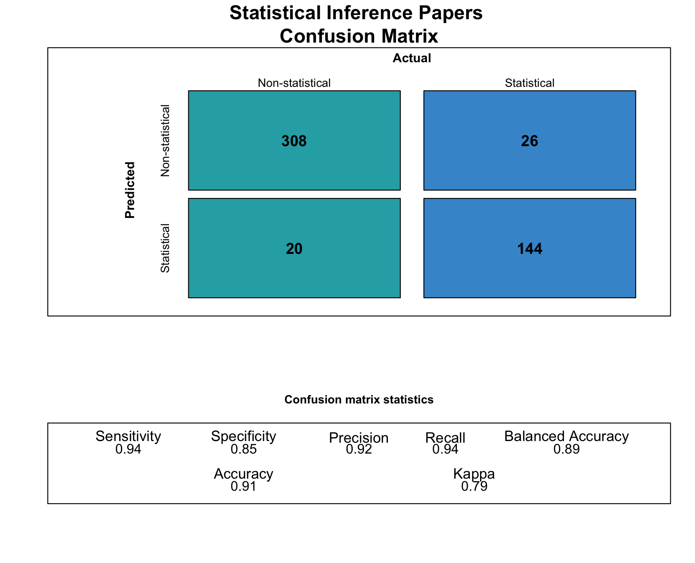
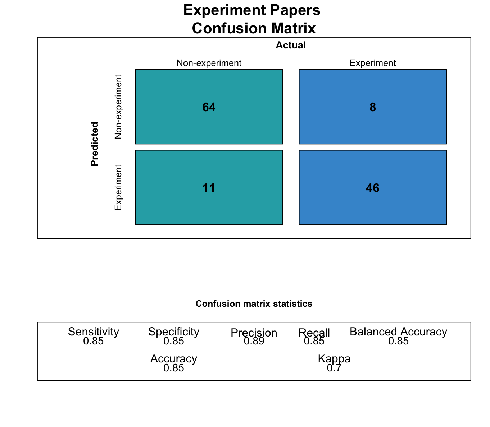
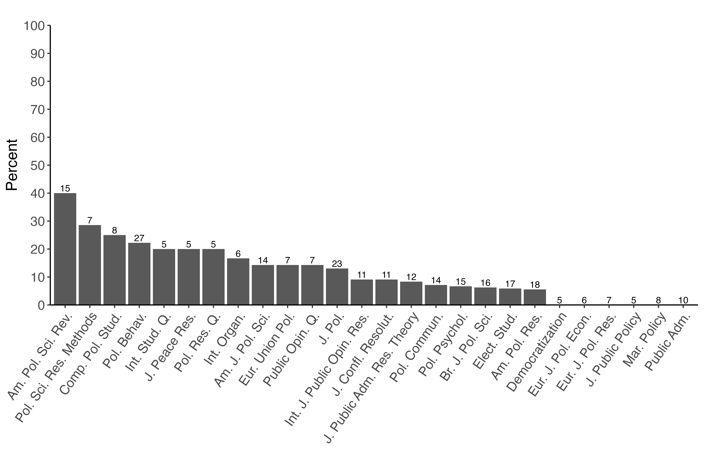
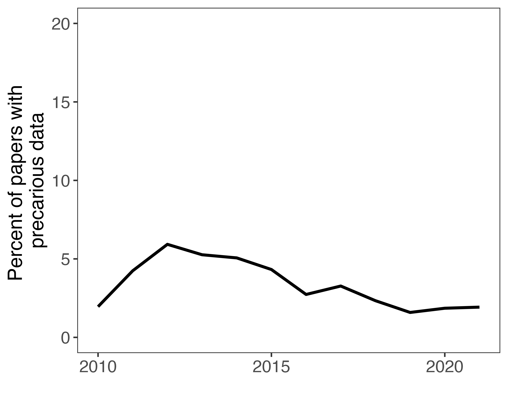

# Appendix
\singlespacing

```{r, echo=FALSE, fig.cap="", message=FALSE, warning=FALSE, fig.align = 'center'}
library(flextable)
library(tidyverse)
options(knitr.kable.NA = '')

jcr_ps <- read.csv("output/JCR_Political_Science.csv") %>%
  head(100) %>%
  mutate(Category = "PS")

jcr_ir <- read.csv("output/JCR_International_Relations.csv") %>%
  head(100) %>%
  mutate(Category = "IR") %>%
  select(-c(X))

combined_jcr <- merge(jcr_ps, jcr_ir, all = TRUE) %>%
  select(-c(JIF.Quartile)) %>% # Prevents pivot of Cambridge Review of International Affairs
  group_by(Journal.name) %>%
  mutate(row_id = row_number(),
         X2020.JIF = as.numeric(X2020.JIF),
         X2020.JIF = round(X2020.JIF, digits = 1),
         X2020.JCI = as.numeric(X2020.JCI),
         X2020.JCI = round(X2020.JCI, digits = 1)) %>%
  ungroup() %>%
  pivot_wider(names_from = row_id, values_from = Category, names_prefix = "Category_") %>%
  select(c(Journal.name, Category_1, Category_2, X2020.JIF)) %>%
  rename(
    `Journal name` = Journal.name,
    `Category 1` = Category_1,
    `Category 2` = Category_2,
    `JIF 2020` = X2020.JIF
  ) %>% 
  arrange(desc(`JIF 2020`))

flextable::flextable(combined_jcr) %>%
  set_caption(caption = "Journals analysed as ranked by Journal Citation Report 2020.") %>%
  set_table_properties(width = .8, layout = "autofit") %>%
  colformat_double(j = 2:4, digits = 2) %>%
  width(j = 1, width = 6) %>%
  width(j = 2, width = 2) %>%
  width(j = 3, width = 2) %>%
  width(j = 4, width = 2) %>%
  theme_booktabs()

```

\newpage
```{=tex}
\begin{figure}
  \centering
  \includegraphics[width=1\textwidth]{./graphs/stat_inf_svm_plot.png}
  \caption{Support vector machine (SVM) confusion matrix for statistical inference paper classification.}
\end{figure}
```

<!-- \newpage -->
<!-- ```{r, echo=FALSE, fig.cap="Support vector machine (SVM) confusion matrix for statistical inference paper classification.", out.width='100%'} -->
<!--  -->
<!-- ``` -->

\newpage
```{=tex}
\begin{figure}
  \centering
  \includegraphics[width=1\textwidth]{./graphs/experiment_svm_plot.png}
  \caption{Support vector machine (SVM) confusion matrix for experiment paper classification.}
\end{figure}
```

<!-- \newpage -->
<!-- ```{r, echo=FALSE, fig.cap="Support vector machine (SVM) confusion matrix for experiment paper classification.", out.width='100%'} -->
<!--  -->
<!-- ``` -->

\newpage
```{=tex}
\begin{sidewaysfigure}
  \centering
  \includegraphics[width=1\textwidth]{./graphs/od_journal_all.png}
  \caption{Open data by journal.}
\end{sidewaysfigure}
```

<!-- \newpage -->
<!-- ```{r, echo=FALSE, fig.cap="Open data by journal.", out.width='100%'} -->
<!-- knitr::include_graphics("./graphs/od_journal_all.png") -->
<!-- ``` -->

\newpage
```{=tex}
\begin{sidewaysfigure}
  \centering
  \includegraphics[width=1\textwidth]{./graphs/od_journal_all_2020.png}
  \caption{Open data by journal in 2020.}
\end{sidewaysfigure}
```

<!-- \newpage -->
<!-- ```{r, echo=FALSE, fig.cap="Open data by journal.", out.width='100%'} -->
<!-- knitr::include_graphics("./graphs/od_journal_all_2020.png") -->
<!-- ``` -->

\newpage
```{=tex}
\begin{figure}
  \centering
  \includegraphics[width=1\textwidth]{./graphs/od_journal_2020.png}
  \caption{Open data by journal (with over 20 statistical inference papers) in 2020.}
\end{figure}
```

<!-- \newpage -->
<!-- ```{r, echo=FALSE, fig.cap="Open data by journal (with over 20 statistical inference papers) in 2020.", out.width='100%'} -->
<!-- knitr::include_graphics("./graphs/od_journal_2020.png") -->
<!-- ``` -->

\newpage
```{=tex}
\begin{sidewaysfigure}
  \centering
  \includegraphics[width=1\textwidth]{./graphs/prereg_journal_all.png}
  \caption{Preregistration by journal.}
\end{sidewaysfigure}
```

<!-- \newpage -->
<!-- ```{r, echo=FALSE, fig.cap="Preregistration by journal.", out.width='100%'} -->
<!-- knitr::include_graphics("./graphs/prereg_journal_all.png") -->
<!-- ``` -->

\newpage
```{=tex}
\begin{sidewaysfigure}
  \centering
  \includegraphics[width=1\textwidth]{./graphs/prereg_journal_all_2020.png}
  \caption{Preregistration by journal in 2020.}
\end{sidewaysfigure}
```

<!-- \newpage -->
<!-- ```{r, echo=FALSE, fig.cap="Preregistration by journal in 2020.", out.width='100%'} -->
<!-- knitr::include_graphics("./graphs/prereg_journal_all_2020.png") -->
<!-- ``` -->

\newpage
```{=tex}
\begin{figure}
  \centering
  \includegraphics[width=1\textwidth]{./graphs/prereg_journal_2020.png}
  \caption{Preregistration by journal (with over 5 experimental papers) in 2020.}
\end{figure}
```

<!-- \newpage -->
<!-- ```{r, echo=FALSE, fig.cap="Preregistration by journal (with over 5 experimental papers) in 2020.", out.width='100%'} -->
<!--  -->
<!-- ``` -->

\newpage
```{=tex}
\begin{figure}
  \centering
  \includegraphics[width=1\textwidth]{./graphs/pd_time.png}
  \caption{Precarious data by year.}
\end{figure}
```

<!-- \newpage -->
<!-- ```{r, echo=FALSE, fig.cap="Precarious data by year.", out.width='100%'} -->
<!--  -->
<!-- ``` -->

\newpage

## Identifying papers relying on data analysis
\doublespacing
We defined data analysis papers as those that made any display or presentation of numerical data, most commonly in tables and graphs. Maps that included data-rich overlays and required software to produce were included in this category.